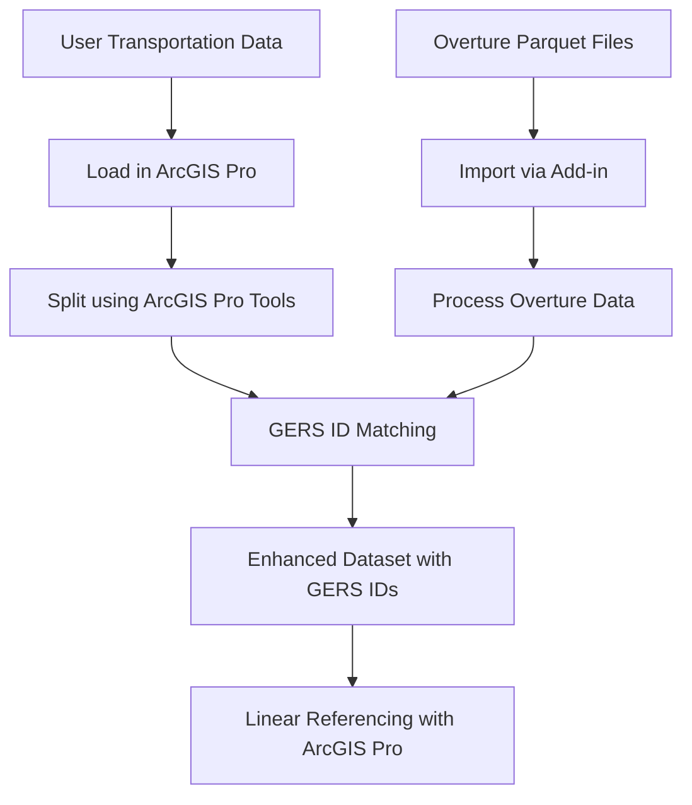

# Overture GERS ID Matcher

## 🎯 Overview

The **Overture GERS ID Matcher** is an ArcGIS Pro add-in feature that enables users to:

1. **Load Overture Maps Data** - Import transportation data from Overture Maps Parquet files
2. **Match User Data to GERS IDs** - Conflate existing transportation data with Overture's Global Entity Reference System
3. **Leverage Native ArcGIS Tools** - Use built-in ArcGIS Pro splitting and LRS tools for segment processing

This provides a bridge between local/regional transportation datasets and the emerging global standard for transportation network referencing.

## 🌟 Why This Approach is Better

### **Strategic Focus**
- **Data Loading**: Best-in-class Overture Maps Parquet import
- **GERS Matching**: Unique conflation capabilities not available elsewhere  
- **Native Integration**: Use ArcGIS Pro's proven splitting and LRS tools instead of reinventing them

### **Workflow Integration**
1. **Load Overture Data** → This add-in imports Parquet files seamlessly
2. **Load User Data** → Standard ArcGIS Pro data sources (Shapefiles, Geodatabases, etc.)
3. **Split if Needed** → Use native ArcGIS Pro tools (Split, Create Routes, etc.)
4. **Match to GERS** → This add-in provides sophisticated conflation
5. **Enhanced LRS** → Use standard ArcGIS Pro Linear Referencing tools with GERS IDs

### **Technical Advantages**
- **Proven Splitting**: ArcGIS Pro's splitting tools are mature and well-tested
- **Focus on Value**: This add-in focuses on unique capabilities (Overture import + GERS matching)
- **Better Performance**: Native tools are optimized for large datasets
- **Familiar Interface**: Users already know ArcGIS Pro splitting workflows

## 🏗️ Architecture

### **Core Components**

1. **Overture Data Loader** ✅
   - Parquet file import and processing
   - Geometry conversion and validation
   - Attribute mapping and cleaning

2. **GERS ID Matcher** 🚧
   - Spatial conflation engine
   - Attribute comparison algorithms
   - Confidence scoring system
   - Manual review interface

3. **ArcGIS Pro Integration** 📋
   - Leverage native splitting tools
   - Use built-in Linear Referencing System
   - Standard geoprocessing framework

### **Recommended Workflow**



## 🛠️ Implementation Plan

### **Phase 1: Data Loading Foundation** ✅
- [x] Create new branch from main
- [x] Remove transportation splitter code  
- [x] Focus on core value proposition
- [ ] Enhance Overture data loading capabilities

### **Phase 2: GERS Matching Core**
- [ ] Implement spatial indexing (R-tree or grid-based)
- [ ] Build geometric similarity algorithms
- [ ] Create attribute comparison engine
- [ ] Develop confidence scoring system

### **Phase 3: User Interface**
- [ ] Streamlined interface for loading + matching
- [ ] Remove splitting UI (delegate to ArcGIS Pro)
- [ ] Interactive review interface for uncertain matches
- [ ] Integration with ArcGIS Pro geoprocessing framework

### **Phase 4: ArcGIS Pro Integration**
- [ ] Documentation for recommended splitting workflows
- [ ] Seamless handoff to native LRS tools
- [ ] Export formats optimized for ArcGIS Pro
- [ ] Geoprocessing tool integration

## 📊 Focused Feature Set

### **What This Add-in Does**
✅ **Overture Data Import** - Best-in-class Parquet loading  
✅ **GERS ID Matching** - Sophisticated conflation algorithms  
✅ **Quality Reporting** - Match confidence and statistics  
✅ **ArcGIS Integration** - Seamless workflow handoff  

### **What ArcGIS Pro Does Better**
✅ **Segment Splitting** - Mature, proven tools  
✅ **Linear Referencing** - Full LRS capability  
✅ **Route Creation** - Comprehensive route management  
✅ **Geometric Operations** - Optimized spatial processing  

## 🎯 Strategic Value

### **Clear Positioning**
- **Not a replacement** for ArcGIS Pro capabilities
- **Complementary tool** that adds Overture Maps integration
- **Gateway** to the GERS ecosystem for ArcGIS users

### **Competitive Advantages**
- **First-to-market** Overture GERS conflation for ArcGIS Pro
- **Focused excellence** rather than feature bloat
- **Strategic partnerships** with existing ArcGIS workflows
- **Future-proof architecture** for GERS ecosystem growth

## 🚀 Getting Started

### **Current Branch Setup**
```bash
# Switch to the clean GERS matcher branch
git checkout feature/overture-gers-matcher

# This branch now contains:
# - OvertureGERSMatcher.cs (GERS matching service)
# - DataProcessor.cs (Overture data loading)
# - MfcUtility.cs (utility functions)
# - Clean UI focused on loading + matching
```

### **Recommended User Workflow**
1. **Import Overture Data** → Use this add-in
2. **Load Your Data** → Standard ArcGIS Pro import
3. **Split Segments** → Use ArcGIS Pro splitting tools as needed
4. **Match to GERS** → Use this add-in's conflation features
5. **Build LRS** → Use ArcGIS Pro Linear Referencing tools

## 📋 Current Status

### **✅ Completed**
- Removed transportation splitting code
- Created focused GERS matching service architecture
- Established clear positioning and workflow

### **🚧 In Progress**
- Enhanced Overture data loading
- GERS matching algorithm implementation
- Streamlined user interface

### **📋 Next Priorities**
1. Complete data loading implementations
2. Build core matching algorithms  
3. Create clean, focused UI
4. Document integration with ArcGIS Pro tools

---

*This focused approach positions the add-in as a strategic bridge to the Overture Maps ecosystem while leveraging ArcGIS Pro's proven capabilities for transportation data processing.* 