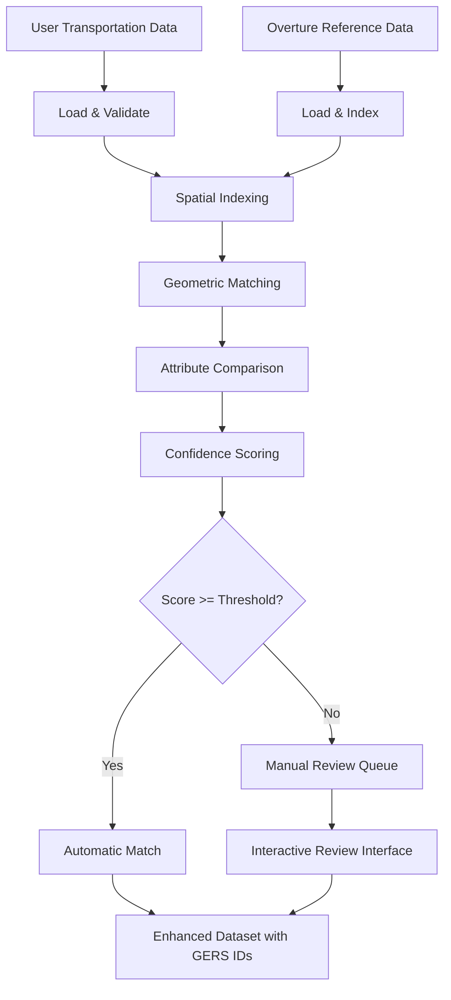

# Overture GERS ID Matcher

## 🎯 Overview

The **Overture GERS ID Matcher** is an ArcGIS Pro add-in feature that enables users to match their existing transportation data to Overture Maps data and assign **GERS (Global Entity Reference System) IDs**. This provides a bridge between local/regional transportation datasets and the emerging global standard for transportation network referencing.

## 🌟 Why GERS ID Matching Matters

### **Strategic Value**
- **Global Interoperability**: Link local data to worldwide transportation standards
- **Future-Proof Integration**: GERS IDs are designed to be persistent across Overture updates
- **Cross-Platform Compatibility**: Enable data sharing between organizations using common references
- **Enhanced Data Quality**: Leverage Overture's comprehensive global transportation network

### **Business Applications**
- **DOTs/Transportation Agencies**: Match road inventories to global standards
- **Logistics & Fleet Management**: Align route data with standardized network IDs
- **Emergency Services**: Coordinate using common reference systems
- **Urban Planning**: Compare local infrastructure against global context
- **Navigation Systems**: Bridge proprietary data with open standards

## 🏗️ Architecture

### **Core Components**

1. **Spatial Conflation Engine**
   - Buffer-based geometric matching
   - Centerline alignment algorithms
   - Multi-scale spatial indexing

2. **Attribute Comparison Engine**
   - Road classification matching
   - Name similarity algorithms (Levenshtein distance)
   - Speed limit and infrastructure attribute comparison

3. **Confidence Scoring System**
   - Weighted spatial + semantic similarity scores
   - Configurable thresholds for match quality
   - Manual review flagging for uncertain matches

4. **Match Classification**
   - **Exact Match**: Perfect geometric and attribute alignment
   - **Partial Match**: Good spatial overlap with minor attribute differences
   - **Conflated Match**: Multiple user segments → single Overture segment
   - **Split Match**: Single user segment → multiple Overture segments
   - **Unmatched**: Local data with no Overture equivalent

### **Workflow**



## 🛠️ Implementation Plan

### **Phase 1: Foundation** ✅
- [x] Create new branch from main
- [x] Define core data structures and interfaces
- [x] Set up matcher service framework
- [ ] Implement basic Parquet data loading

### **Phase 2: Core Matching**
- [ ] Implement spatial indexing (R-tree or grid-based)
- [ ] Build geometric similarity algorithms
- [ ] Create attribute comparison engine
- [ ] Develop confidence scoring system

### **Phase 3: User Interface**
- [ ] Add matcher to ArcGIS Pro dockpane
- [ ] Create configuration interface
- [ ] Build interactive review interface for uncertain matches
- [ ] Implement progress reporting and logging

### **Phase 4: Advanced Features**
- [ ] Batch processing for large datasets
- [ ] Export enhanced data with GERS IDs
- [ ] Quality reporting and statistics
- [ ] Integration with existing ArcGIS workflows

### **Phase 5: Testing & Optimization**
- [ ] Performance optimization for large datasets
- [ ] Validation with real-world datasets
- [ ] Documentation and user guides
- [ ] Integration testing with various data formats

## 📊 Match Configuration Options

```csharp
public class MatchConfiguration
{
    // Spatial matching parameters
    public double SpatialToleranceMeters { get; set; } = 50.0;
    
    // Confidence thresholds
    public double MinimumConfidenceScore { get; set; } = 0.7;
    
    // Scoring weights
    public double SpatialWeight { get; set; } = 0.6;        // 60% spatial
    public double AttributeWeight { get; set; } = 0.4;      // 40% attributes
    
    // Attribute comparison fields
    public List<string> ComparisonAttributes { get; set; } = new List<string>
    {
        "class",        // Road functional classification
        "name",         // Street/road name
        "speed_limit",  // Posted speed limit
        "surface",      // Pavement type
        "lanes"         // Number of lanes
    };
    
    // Quality control
    public bool IncludeManualReviewCandidates { get; set; } = true;
}
```

## 🎛️ User Interface Integration

The matcher will integrate into the existing ArcGIS Pro add-in interface:

1. **New Tab**: "GERS Matcher" in the main dockpane
2. **Input Selection**: Browse for user data and Overture reference data
3. **Configuration Panel**: Adjust matching parameters and thresholds
4. **Progress Monitoring**: Real-time status and statistics
5. **Review Interface**: Interactive map-based review of uncertain matches
6. **Export Options**: Save enhanced data with GERS IDs

## 🧪 Testing Strategy

### **Test Datasets**
- Small urban road network (< 1,000 segments)
- Rural highway system
- Mixed urban/suburban area
- International road network sample

### **Validation Metrics**
- **Precision**: % of matches that are actually correct
- **Recall**: % of possible matches that were found
- **F1 Score**: Harmonic mean of precision and recall
- **Processing Speed**: Features processed per second
- **User Satisfaction**: Manual review acceptance rate

## 🔄 Integration with Existing Workflow

The GERS matcher complements rather than replaces the transportation splitter:

1. **Use Splitter First**: Split segments at logical breakpoints for better matching
2. **Apply GERS Matcher**: Match split segments to Overture data
3. **Enhanced LRS**: Use GERS IDs for linear referencing and route analysis

## 📈 Expected Benefits

### **Immediate Value**
- Works with existing user data formats
- No need to recreate transportation networks
- Provides global standardization pathway

### **Long-term Impact**
- Positions users for future Overture Maps ecosystem
- Enables cross-organizational data sharing
- Supports emerging transportation data standards
- Facilitates integration with autonomous vehicle systems

## 🚀 Getting Started

```bash
# Switch to the matcher branch
git checkout feature/overture-gers-matcher

# Build and test the foundation
# (Implementation in progress)
```

## 📋 TODO

### Priority 1 (Core Functionality)
- [ ] Complete data loading implementations
- [ ] Build spatial indexing system
- [ ] Implement geometric matching algorithms
- [ ] Create confidence scoring engine

### Priority 2 (User Experience)
- [ ] Design and implement UI components
- [ ] Add interactive review capabilities
- [ ] Implement progress reporting
- [ ] Create comprehensive logging

### Priority 3 (Advanced Features)
- [ ] Performance optimization
- [ ] Batch processing capabilities
- [ ] Advanced spatial algorithms (Hausdorff distance, etc.)
- [ ] Export format options

---

*This feature represents a strategic investment in the future of transportation data interoperability and positions the ArcGIS Pro add-in as a leader in Overture Maps ecosystem adoption.* 